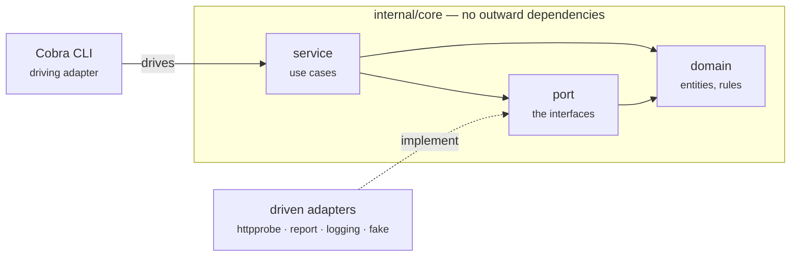


This describes the shape of a project generated from the template, and the
reasoning behind that shape. The template's own layout is documented in
[the site's Getting started page](https://tarakm89.github.io/go-cli-go-template/usage.html).

## The problem

The tools we build are command line programs that run inside CI pipelines and
talk to a lot of external systems — HTTP APIs, registries, cloud control
planes. Two things go wrong with such tools over time:

1. **The transport eats the logic.** Retry policy, pagination and error mapping
   creep into the code that is supposed to express a decision, until nobody can
   say what the rule actually is.
2. **They become untestable.** Once the logic reaches for the network directly,
   the only way to test it is with a network, so it stops being tested.

Both are the same problem: no boundary between what the tool decides and how it
talks to the world.

## The shape

Ports and adapters. The core holds the rules and knows nothing about the
outside; everything external is reached through an interface the core owns.

| Layer | Package | May import |
| --- | --- | --- |
| Domain | `internal/core/domain` | nothing but the standard library |
| Ports | `internal/core/port` | `domain` |
| Use cases | `internal/core/service` | `domain`, `port` |
| Driving adapter | `internal/adapter/inbound/cli` | `port`, the outbound adapters |
| Driven adapters | `internal/adapter/outbound/*` | `domain`, `port` |
| Composition root | `internal/bootstrap`, `cli.setup` | everything |

## Decisions

### The dependency rule is enforced by a linter

A diagram in a README decays; a failing build does not. `depguard` in
`.golangci.yml` fails if anything under `internal/core` imports an adapter,
Cobra, `net/http` or the OpenTelemetry SDK, each denial carrying an
explanation.

*Cost:* an occasional false positive, and test files must be exempted so a unit
test can use the fake adapters. *Worth it:* the boundary survives deadlines.

### Observability is applied by decoration

Instrumenting a use case in place turns it into 40% telemetry boilerplate, and
nobody refactors that. Instead `internal/adapter/outbound/telemetry` wraps a
port implementation and emits spans and metrics around it. The core cannot tell
whether it is talking to a real adapter or an instrumented one.

See [spec 0002](specs/0002-observability-in-ci.html).

### Fakes are shipped code, not test fixtures

`internal/adapter/outbound/fake` is an ordinary package, so the functional
suite can wire the real command tree and the real use cases while faking only
what would reach the network. The same behaviour table then runs through both
the functional suite and the end-to-end suite, so a fake that drifts from the
real adapter fails the build.

*Alternative rejected:* generated mocks. They assert on how a call was made,
which couples every test to the implementation and turns each refactor into a
test rewrite.

### External failure is data, not an exception

An external system being down is an answer, not an error. `Check` returns a
verdict; `error` is reserved for "I could not do the job". The exit codes make
the same distinction: `1` could not run, `2` ran and the news is bad.

### The composition root is the only place that names concrete types

One function — `setup()` in `internal/adapter/inbound/cli` — decides that the
prober is `httpprobe` wrapped in a telemetry decorator. That is not ceremony:
it is what lets a functional test swap one field and run the whole application
against fakes.

## What this costs

Ports and adapters is more indirection than a small tool needs on day one. We
accept that because these tools grow: the second external system is the one
that would otherwise force a rewrite, and by then the deadline is closer.

For a genuinely one-off script, do not use this template.

