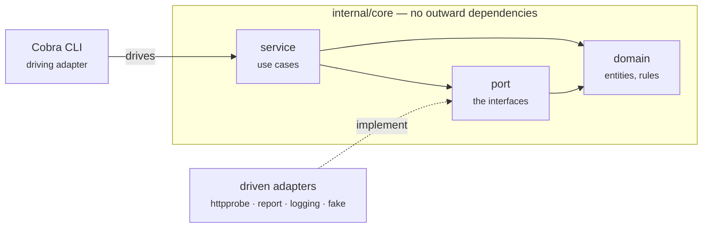

<p class="eyebrow">Cookiecutter template</p>

# Go CLI scaffolding that already passes its own checks

A template for Go command line tools. It scaffolds a
[Cobra](https://github.com/spf13/cobra) CLI built as a hexagon, wired for
OpenTelemetry, tested at three levels, and set up to run inside CI pipelines.

```sh
pipx install cookiecutter
cookiecutter gh:tarakm89/go-cli-go-template
cd my-cli
./scripts/bootstrap.sh    # .\scripts\bootstrap.ps1 on Windows
make check
```

`make check` is green on a freshly generated project — formatting, linting,
`go vet`, race-enabled unit tests, a functional suite and an end-to-end suite.
That is the point. You start from something that already holds the line, and
you keep it there.

<div class="cards">

<a class="card" href="{{ '/docs/architecture.html' | relative_url }}">
  <span class="card-kicker">Architecture</span>
  <span class="card-title">How it is built, and why</span>
  <span class="card-body">Ports and adapters, the decisions behind them, and what each one costs. Start here if you want to know why the core cannot import <code>net/http</code>.</span>
  <span class="card-more">Read the architecture &rarr;</span>
</a>

<a class="card" href="{{ '/docs/specs/index.html' | relative_url }}">
  <span class="card-kicker">Specification</span>
  <span class="card-title">What it should do</span>
  <span class="card-body">One document per capability, written before it was built, each with acceptance criteria and the alternatives that lost. Plus the plans that carried them.</span>
  <span class="card-more">Read the specs &rarr;</span>
</a>

<a class="card" href="{{ '/docs/reference/index.html' | relative_url }}">
  <span class="card-kicker">Reference</span>
  <span class="card-title">Every package and command</span>
  <span class="card-body">Usage and code documentation, generated by gomarkdoc and Cobra from the worked example — with a code map of every exported type, method and function.</span>
  <span class="card-more">Browse the reference &rarr;</span>
</a>

</div>

<p class="card-secondary">
  Also here:
  <a href="{{ '/usage.html' | relative_url }}">Getting started</a> ·
  <a href="{{ '/configured.html' | relative_url }}">What's configured</a> ·
  <a href="{{ '/mentality.html' | relative_url }}">How we write code</a> ·
  <a href="{{ '/docs/index.html' | relative_url }}">All documents</a> ·
  <a href="{{ '/versions.html' | relative_url }}">Versions</a>
</p>

## The shape

The core holds the rules and knows nothing about the outside world. Everything
external is reached through a port that an adapter implements. Arrows only ever
point inward.



## What you get

| | |
| --- | --- |
| **Architecture** | Hexagonal — domain, ports, use cases, adapters — with the dependency rule **enforced by a linter**, not left to discipline |
| **CLI** | Cobra command tree, meaningful exit codes, `--output text\|json`, a `--fail-on` gate for pipelines |
| **Observability** | OpenTelemetry traces, metrics and logs; OTLP over HTTP or gRPC, `stdout` for debugging, silent no-ops when no collector is configured |
| **CI awareness** | Adopts `TRACEPARENT` so a run joins the pipeline's trace; detects GitHub Actions, GitLab CI and generic runners |
| **Testing** | Table-driven unit tests, Ginkgo **functional** specs that run the whole app in-process against fake adapters, **e2e** specs against the compiled binary |
| **Quality gates** | golangci-lint v2 for lint *and* format, repo-local pre-commit hooks, race detector |
| **Docs** | gomarkdoc for packages, Cobra for commands, published to `gh-pages`; CI fails if they drift |
| **Cross-platform** | Windows, macOS and Linux, for development and for CI |

## The idea worth keeping

Two properties do most of the work, and they are the same property seen from
two angles: **the core talks to the outside world only through interfaces.**

Because of that, **telemetry is a decorator**. You wrap a port implementation
and emit spans around it; the core is never edited to add instrumentation.

```go
prober = telemetry.NewProber(prober, tracer, instruments, logger)
```

Also because of that, **tests are fast**. The functional suite wires the real
command tree and the real use cases, and fakes only what would reach the
network:

```go
app.Prober.With("https://api.example.com", fake.Response{StatusCode: 503})

Expect(app.Run("check", "https://api.example.com")).To(Equal(cli.ExitUnhealthy))
Expect(app.Stdout()).To(ContainSubstring("summary: down"))
Expect(app.SpanNames()).To(ContainElement("probe api.example.com"))
```

Everything else on this site is plumbing in service of that.
