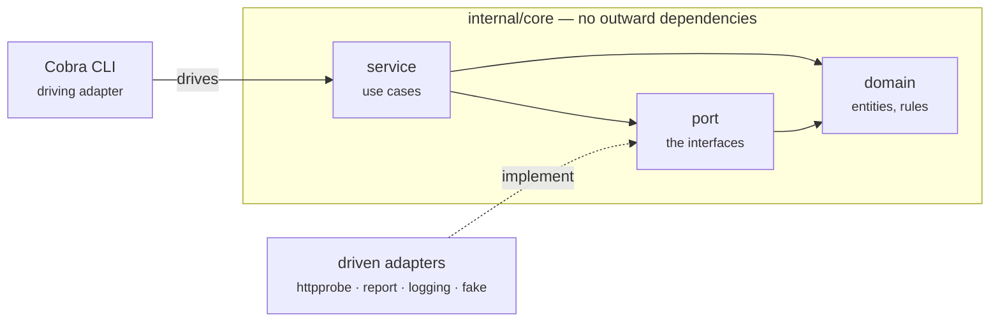

`make check` is green on a freshly generated project — formatting, linting,
`go vet`, race-enabled unit tests, a functional suite and an end-to-end suite.
That is the point. You start from something that already holds the line, and
you keep it there.

<div class="cards">

<a class="card" href="{{ '/docs/architecture.html' | relative_url }}">
  <span class="card-icon" aria-hidden="true">
    <svg viewBox="0 0 24 24"><path d="M12 3l8 4.5v9L12 21l-8-4.5v-9L12 3z"/><path d="M12 12l8-4.5M12 12v9M12 12L4 7.5"/></svg>
  </span>
  <span class="card-kicker">Architecture</span>
  <span class="card-title">How it is built, and why</span>
  <span class="card-body">Ports and adapters, the decisions behind them, and what each one costs. Start here if you want to know why the core cannot import <code>net/http</code>.</span>
  <span class="card-more">Read the architecture &rarr;</span>
</a>

<a class="card" href="{{ '/docs/specs/index.html' | relative_url }}">
  <span class="card-icon" aria-hidden="true">
    <svg viewBox="0 0 24 24"><path d="M7 3h7l5 5v13a1 1 0 0 1-1 1H7a1 1 0 0 1-1-1V4a1 1 0 0 1 1-1z"/><path d="M14 3v5h5M9 13h6M9 17h4"/></svg>
  </span>
  <span class="card-kicker">Specification</span>
  <span class="card-title">What it should do</span>
  <span class="card-body">One document per capability, written before it was built, each with acceptance criteria and the alternatives that lost. Plus the plans that carried them.</span>
  <span class="card-more">Read the specs &rarr;</span>
</a>

<a class="card" href="{{ '/docs/reference/index.html' | relative_url }}">
  <span class="card-icon" aria-hidden="true">
    <svg viewBox="0 0 24 24"><path d="M9 7l-5 5 5 5M15 7l5 5-5 5"/></svg>
  </span>
  <span class="card-kicker">Reference</span>
  <span class="card-title">Every package and command</span>
  <span class="card-body">Usage and code documentation, generated by gomarkdoc and Cobra from the worked example — with a code map of every exported type, method and function.</span>
  <span class="card-more">Browse the reference &rarr;</span>
</a>

</div>

## The shape

The core holds the rules and knows nothing about the outside world. Everything
external is reached through a port that an adapter implements. Arrows only ever
point inward.



## What you get

<div class="features">
  <div class="feature">
    <h3>Enforced architecture</h3>
    <p>Hexagonal — domain, ports, use cases, adapters — with the dependency rule checked by <code>depguard</code>, not left to discipline.</p>
  </div>
  <div class="feature">
    <h3>Observability out of the box</h3>
    <p>OpenTelemetry traces, metrics and logs over OTLP, <code>stdout</code> for debugging, and silent no-ops when no collector is configured.</p>
  </div>
  <div class="feature">
    <h3>Built for pipelines</h3>
    <p>Meaningful exit codes, <code>--output json</code>, a <code>--fail-on</code> gate, and a <code>TRACEPARENT</code> that joins the pipeline's trace.</p>
  </div>
  <div class="feature">
    <h3>Three tiers of tests</h3>
    <p>Table-driven unit tests, Ginkgo functional specs that run the whole app against fake adapters, and end-to-end specs against the compiled binary.</p>
  </div>
  <div class="feature">
    <h3>Quality gates</h3>
    <p><code>golangci-lint</code> v2 for lint and format, repo-local pre-commit hooks, the race detector, and CI on all three operating systems.</p>
  </div>
  <div class="feature">
    <h3>Documentation that cannot drift</h3>
    <p>gomarkdoc for packages and Cobra for commands, published automatically. CI fails if <code>make docs</code> produces a diff.</p>
  </div>
</div>

## The idea worth keeping

Two properties do most of the work, and they are the same property seen from
two angles: **the core talks to the outside world only through interfaces.**

Because of that, **telemetry is a decorator**. You wrap a port implementation
and emit spans around it; the core is never edited to add instrumentation.

```go
prober = telemetry.NewProber(prober, tracer, instruments, logger)
```

Also because of that, **tests are fast**. The functional suite wires the real
command tree and the real use cases, and fakes only what would reach the
network:

```go
app.Prober.With("https://api.example.com", fake.Response{StatusCode: 503})

Expect(app.Run("check", "https://api.example.com")).To(Equal(cli.ExitUnhealthy))
Expect(app.Stdout()).To(ContainSubstring("summary: down"))
Expect(app.SpanNames()).To(ContainElement("probe api.example.com"))
```

Everything else on this site is plumbing in service of that.
