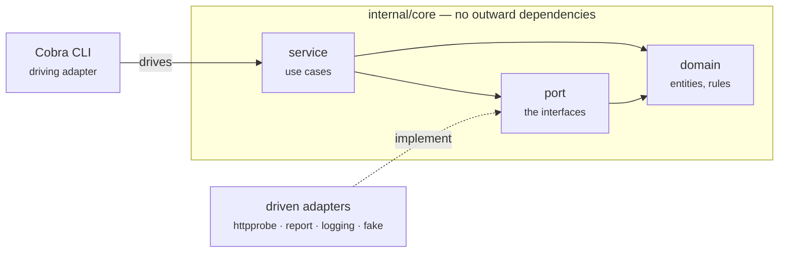

<section class="hero">
  <div class="wrap hero-inner">
    <a class="hero-badge" href="{{ '/versions.html' | relative_url }}">
      <span class="dot" aria-hidden="true"></span>
      <b>v{{ site.data.versions.latest }}</b> releasedActively maintained
    </a>

    <h1 class="hero-title">Go CLI scaffolding that<br><span class="grad">already passes its own checks</span></h1>

    <p class="hero-sub">
      A cookiecutter template for Go command line tools. It scaffolds a Cobra CLI
      built as a hexagon, wired for OpenTelemetry, tested at three levels, and set
      up to run inside CI pipelines.
    </p>

    <div class="hero-actions">
      <a class="btn btn--primary" href="{{ '/usage.html' | relative_url }}">
        Get started
        <svg viewBox="0 0 24 24" aria-hidden="true"><path d="M5 12h14M13 6l6 6-6 6"/></svg>
      </a>
      <a class="btn btn--ghost" href="{{ site.repository_url }}" rel="noopener">
        <svg viewBox="0 0 24 24" aria-hidden="true" style="fill:currentColor;stroke:none"><path d="M12 2a10 10 0 0 0-3.16 19.49c.5.09.68-.22.68-.48l-.01-1.7c-2.78.6-3.37-1.34-3.37-1.34-.45-1.16-1.11-1.47-1.11-1.47-.91-.62.07-.61.07-.61 1 .07 1.53 1.03 1.53 1.03.89 1.53 2.34 1.09 2.91.83.09-.65.35-1.09.63-1.34-2.22-.25-4.55-1.11-4.55-4.94 0-1.09.39-1.98 1.03-2.68-.1-.25-.45-1.27.1-2.64 0 0 .84-.27 2.75 1.02a9.5 9.5 0 0 1 5 0c1.91-1.29 2.75-1.02 2.75-1.02.55 1.37.2 2.39.1 2.64.64.7 1.03 1.59 1.03 2.68 0 3.84-2.34 4.69-4.57 4.94.36.31.68.92.68 1.86l-.01 2.75c0 .27.18.58.69.48A10 10 0 0 0 12 2z"/></svg>
        View on GitHub
      </a>
    </div>

    <div class="hero-code">
      <div class="hero-code-bar" aria-hidden="true"><i></i><i></i><i></i><span>terminal</span></div>

pipx install cookiecutter
cookiecutter gh:tarakm89/go-cli-go-template
cd my-cli && ./scripts/bootstrap.sh
make check

    </div>
  </div>
</section>

<div class="wrap page-layout page-layout--plain">
<main class="content" markdown="1">

`make check` is green on a freshly generated project — formatting, linting,
`go vet`, race-enabled unit tests, a functional suite and an end-to-end suite.
That is the point. You start from something that already holds the line, and
you keep it there.

<div class="cards">

<a class="card" href="{{ '/docs/architecture.html' | relative_url }}">
  <span class="card-icon" aria-hidden="true">
    <svg viewBox="0 0 24 24"><path d="M12 3l8 4.5v9L12 21l-8-4.5v-9L12 3z"/><path d="M12 12l8-4.5M12 12v9M12 12L4 7.5"/></svg>
  </span>
  <span class="card-kicker">Architecture</span>
  <span class="card-title">How it is built, and why</span>
  <span class="card-body">Ports and adapters, the decisions behind them, and what each one costs. Start here if you want to know why the core cannot import <code>net/http</code>.</span>
  <span class="card-more">Read the architecture &rarr;</span>
</a>

<a class="card" href="{{ '/docs/specs/index.html' | relative_url }}">
  <span class="card-icon" aria-hidden="true">
    <svg viewBox="0 0 24 24"><path d="M7 3h7l5 5v13a1 1 0 0 1-1 1H7a1 1 0 0 1-1-1V4a1 1 0 0 1 1-1z"/><path d="M14 3v5h5M9 13h6M9 17h4"/></svg>
  </span>
  <span class="card-kicker">Specification</span>
  <span class="card-title">What it should do</span>
  <span class="card-body">One document per capability, written before it was built, each with acceptance criteria and the alternatives that lost. Plus the plans that carried them.</span>
  <span class="card-more">Read the specs &rarr;</span>
</a>

<a class="card" href="{{ '/docs/reference/index.html' | relative_url }}">
  <span class="card-icon" aria-hidden="true">
    <svg viewBox="0 0 24 24"><path d="M9 7l-5 5 5 5M15 7l5 5-5 5"/></svg>
  </span>
  <span class="card-kicker">Reference</span>
  <span class="card-title">Every package and command</span>
  <span class="card-body">Usage and code documentation, generated by gomarkdoc and Cobra from the worked example — with a code map of every exported type, method and function.</span>
  <span class="card-more">Browse the reference &rarr;</span>
</a>

</div>

<p class="card-secondary">
  Also here:
  <a href="{{ '/usage.html' | relative_url }}">Getting started</a> ·
  <a href="{{ '/configured.html' | relative_url }}">What's configured</a> ·
  <a href="{{ '/mentality.html' | relative_url }}">How we write code</a> ·
  <a href="{{ '/docs/index.html' | relative_url }}">All documents</a> ·
  <a href="{{ '/versions.html' | relative_url }}">Versions</a>
</p>

## The shape

The core holds the rules and knows nothing about the outside world. Everything
external is reached through a port that an adapter implements. Arrows only ever
point inward.



## What you get

<div class="features">
  <div class="feature">
    <h3>Enforced architecture</h3>
    <p>Hexagonal — domain, ports, use cases, adapters — with the dependency rule checked by <code>depguard</code>, not left to discipline.</p>
  </div>
  <div class="feature">
    <h3>Observability out of the box</h3>
    <p>OpenTelemetry traces, metrics and logs over OTLP, <code>stdout</code> for debugging, and silent no-ops when no collector is configured.</p>
  </div>
  <div class="feature">
    <h3>Built for pipelines</h3>
    <p>Meaningful exit codes, <code>--output json</code>, a <code>--fail-on</code> gate, and a <code>TRACEPARENT</code> that joins the pipeline's trace.</p>
  </div>
  <div class="feature">
    <h3>Three tiers of tests</h3>
    <p>Table-driven unit tests, Ginkgo functional specs that run the whole app against fake adapters, and end-to-end specs against the compiled binary.</p>
  </div>
  <div class="feature">
    <h3>Quality gates</h3>
    <p><code>golangci-lint</code> v2 for lint and format, repo-local pre-commit hooks, the race detector, and CI on all three operating systems.</p>
  </div>
  <div class="feature">
    <h3>Documentation that cannot drift</h3>
    <p>gomarkdoc for packages and Cobra for commands, published automatically. CI fails if <code>make docs</code> produces a diff.</p>
  </div>
</div>

## The idea worth keeping

Two properties do most of the work, and they are the same property seen from
two angles: **the core talks to the outside world only through interfaces.**

Because of that, **telemetry is a decorator**. You wrap a port implementation
and emit spans around it; the core is never edited to add instrumentation.

```go
prober = telemetry.NewProber(prober, tracer, instruments, logger)
```

Also because of that, **tests are fast**. The functional suite wires the real
command tree and the real use cases, and fakes only what would reach the
network:

```go
app.Prober.With("https://api.example.com", fake.Response{StatusCode: 503})

Expect(app.Run("check", "https://api.example.com")).To(Equal(cli.ExitUnhealthy))
Expect(app.Stdout()).To(ContainSubstring("summary: down"))
Expect(app.SpanNames()).To(ContainElement("probe api.example.com"))
```

Everything else on this site is plumbing in service of that.

</main>
</div>
