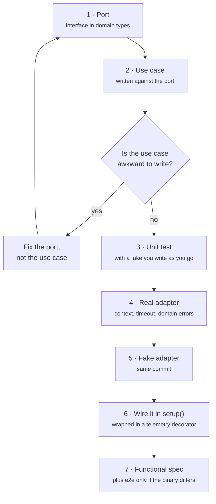

The template gives you a shape. This page is the reasoning behind it, so that
when you hit a case it does not cover you can work out what we would have done.

## The one rule

**Dependencies point inward. Always.**

The domain knows nothing. The use cases know the domain. The adapters know the
use cases. The composition root knows everything. No arrow ever points the
other way.

Everything else on this page is a consequence of that rule, or a habit that
keeps it true under deadline pressure.

We do not rely on you remembering it. `depguard` fails the build if the core
imports an adapter, Cobra, `net/http` or the OpenTelemetry SDK. If you find
yourself reaching for `//nolint` on one of those rules, that is the signal to
stop and ask what belongs where — not the signal to add the comment.

## Where does this code go?

| If it… | It belongs in |
| --- | --- |
| is a rule you could explain to someone who has never seen a computer | `internal/core/domain` |
| is a decision the product makes | `internal/core/domain` |
| orchestrates several rules, or several external systems | `internal/core/service` |
| names a thing the application needs from outside | `internal/core/port` |
| knows a wire format, a protocol, a file path, an env var, or a library | `internal/adapter/outbound/...` |
| knows about flags, arguments or stdout | `internal/adapter/inbound/cli` |
| picks which concrete implementation to use | `internal/bootstrap` and `cli.setup` |

The useful test when you are unsure: **could this code be wrong in a way a
domain expert would notice?** If yes, it is domain or service. If it can only
be wrong in a way an SRE would notice, it is an adapter.

## Ports belong to the core, not to the adapter

A port is written from the point of view of the code that *needs* it, in domain
types, and it lives in `internal/core/port`. It is not the public surface of
some library you happen to be using.

```go
// Good — expressed in what the core wants to know.
type Prober interface {
	Probe(ctx context.Context, target domain.Target) (domain.Probe, error)
}

// Bad — the HTTP adapter's implementation leaking through the boundary.
type Prober interface {
	Get(ctx context.Context, url string) (*http.Response, error)
}
```

The second version compiles fine and looks harmless. It also means every caller
now handles `*http.Response`, the core has to know about status codes and body
closing, and swapping HTTP for gRPC becomes a rewrite instead of a new file.

Keep ports **small**. An interface with one method is a good interface. If a
port grows past three or four methods, it is usually two ports.

## External failure is data, not an exception

An external system being down is not an error in the program. It is the answer.

```go
// Check inspects a single target. Failure is part of the result, not an
// error: an unreachable target is a legitimate verdict.
func (h *Health) Check(ctx context.Context, target domain.Target) domain.Health {
	probe, err := h.prober.Probe(ctx, target)
	if err != nil {
		return domain.Unreachable(target, err)
	}
	return h.thresholds.Evaluate(target, probe)
}
```

Reserve `error` for "I could not do the job." Use a domain type for "I did the
job and here is what I found, which happens to be bad news." This is the same
distinction the exit codes make, and it should hold all the way down.

## Adapters translate errors; the core never sees a transport

Every outbound adapter maps its failures onto a domain sentinel:

```go
resp, err := a.client.Do(req)
if err != nil {
	return domain.Probe{}, fmt.Errorf("%w: %w", domain.ErrUnreachable, err)
}
```

The core matches on `domain.ErrUnreachable`. It never matches on
`*url.Error`, never inspects a status code, and never grows a `switch` on
somebody else's error type. `errorlint` is on, so compare with `errors.Is` and
`errors.As` rather than `==` or a type assertion.

## Every outbound call takes a context

No exceptions. A tool that fans out to external systems and cannot be
cancelled will eventually be the reason a pipeline hangs for its full timeout.
`noctx` enforces this at the boundary; hold the line inside too — pass `ctx`
down, never store it in a struct.

## Concurrency is the service's business, ordering is the user's

When you fan out, preserve input order in the results. The user typed the
arguments in an order and expects to read them back in that order; results that
arrive in completion order are a lottery.

```go
results := make([]domain.Health, len(targets))
// …each goroutine writes results[i]; no append, no shared cursor.
```

Bound the fan-out with a semaphore rather than launching one goroutine per
input. Ten targets is fine unbounded; ten thousand is a denial-of-service
attack on someone you depend on.

## Instrument from the outside

Do not add spans, counters or log lines to a use case. Wrap it.

```go
prober = telemetry.NewProber(prober, tracer, instruments, logger)
checker = telemetry.NewHealthChecker(checker, tracer, instruments)
```

A decorator keeps the core readable — a use case that is 40% observability
boilerplate is a use case nobody will refactor — and it means telemetry can be
swapped, disabled or asserted on in a test without touching business logic.

If you genuinely need the core to say something, that is what `port.Logger` is
for. Use it sparingly; the decorators already cover the mechanical facts.

**Telemetry must never be the reason a run fails.** If the SDK cannot be built,
warn on stderr and carry on with no-ops. Someone's deploy should not be blocked
because a collector is having a bad day.

## The composition root is the only place that names concrete types

One function — `setup()` in `internal/adapter/inbound/cli` — decides that the
prober is `httpprobe`, that it is wrapped in a telemetry decorator, and that
the reporter is text or JSON. Everywhere else deals in interfaces.

That is not ceremony. It is what makes the functional suite possible: swap one
field and the whole application runs against fakes.

Resist the urge to reach for a global, a package-level singleton, or an
`init()`. If a thing is hard to construct, make the constructor take what it
needs and let the composition root do the work.

## You are writing for a pipeline, not for a person

Assume nobody is watching your output.

- **Exit codes are the primary interface.** `0` succeeded, `1` could not run,
  `2` ran and the news is bad. Make the threshold configurable — a canary job
  and a deploy gate want different answers from the same binary.
- **Every human-readable output needs a machine-readable twin.** `--output
  json` is not a nice-to-have; it is how the next step in the pipeline reads
  you. Serialise empty collections as `[]`, never `null`, so `jq` does not fall
  over.
- **Report goes to stdout, everything else to stderr.** A pipe should carry
  data, not log lines.
- **Be quiet by default and loud on request.** `--log-level debug` exists for
  the bad day.

## Tests

### Pick the cheapest tier that can actually fail

| Testing… | Write a… |
| --- | --- |
| a rule, a calculation, a parse | unit test, table-driven |
| an adapter against its real protocol | unit test with `httptest` |
| a command, its flags, its exit code, its output | functional spec with fakes |
| that the binary actually works when built | e2e spec, sparingly |

Most of your tests should be the first three. The e2e tier is for the code
paths that only exist in a shipped binary — flag parsing, exit codes, telemetry
shutdown — not for re-testing logic the functional tier already covers.

### Fakes, not mocks

We use hand-written fakes that behave like the real thing, and we ship them in
`internal/adapter/outbound/fake` as ordinary code.

A mock asserts that a particular call was made in a particular way, which
couples the test to the implementation and makes every refactor a test rewrite.
A fake lets you assert on the *outcome*. `fake.Prober` is programmable per
address, records what it was asked, and can simulate latency, delay and
failure — everything you need, without a single expectation about call order.

When you add a new outbound port, add its fake in the same commit. A port
without a fake will end up tested through the network, and then it will not be
tested at all.

### Guard against fake drift

The obvious objection to fakes is that they can quietly stop resembling
reality. So run the same table through both:

```go
// functional: fake adapter, in-process
Entry("a 500 is down and fails the run", checkCase{
	Response: fake.Response{StatusCode: 500}, WantExit: cli.ExitUnhealthy, WantSummary: "down",
})

// e2e: real binary, real HTTP
Entry("500 is down and fails the run", http.StatusInternalServerError, 2, "down")
```

If they ever disagree, the fake has drifted, and you find out from a red build
instead of from production.

### Write specs as sentences, tables as tables

Ginkgo is for behaviour worth describing: a `Context` that sets a scene, an
`It` that states an expectation someone could read aloud. Reach for
`DescribeTable` the moment a spec would be a copy of the one above it with a
different constant — a new case should be one `Entry`, not fifteen new lines.

Plain Go table tests are right for pure logic. There is no scenario to
describe in `Evaluate(probe) == StateDown`, and wrapping it in BDD adds
ceremony without adding meaning.

Name entries so the failure output reads as a sentence. `"a 404 is degraded,
but does not fail the run by default"` tells you what broke; `"case 3"` sends
you to the source.

### Make time and randomness injectable

Latency assertions against the wall clock are flaky by construction. `fake.Clock`
advances by a fixed step, so the test asserts an exact value:

```go
clock := fake.NewClock(time.Unix(0, 0), 250*time.Millisecond)
probe, _ := httpprobe.New(httpprobe.WithClock(clock)).Probe(ctx, target)

Expect(probe.Latency).To(Equal(250 * time.Millisecond))
```

A test with a `time.Sleep` in it is a test that will fail on a loaded CI runner
at 3am.

### Telemetry is behaviour, so test it

If a refactor stops emitting spans, the dashboards go quiet and nobody notices
for a month. Assert on the shape:

```go
Expect(app.ParentOf("probe a.example.com")).To(Equal("check all"))
```

## Doc comments are the documentation

`docs/api` is generated from your doc comments by gomarkdoc, and `docs/cli`
from the Cobra tree. There is no second place to write things down and no
second place for them to rot.

So: write the comment for someone who has not read the function. Say **why**,
not what — the code already says what. Comments that explain a non-obvious
decision are the ones worth having:

```go
// A CLI run is short and rare; sampling it away loses the only trace
// anyone will ever look at. Honour an inherited decision, though.
sdktrace.WithSampler(sdktrace.ParentBased(sdktrace.AlwaysSample())),
```

CI fails if `make docs` produces a diff, so a new flag cannot ship without its
documentation.

## Adding a new external system

The recipe, in order:

1. **Port first.** Add the interface to `internal/core/port`, in domain types.
   Write it as the core would like it to be, not as the library offers it.
2. **Use case next.** Implement against the interface in
   `internal/core/service`. This is where you find out if the port is right —
   if the use case is awkward, fix the port, not the use case.
3. **Unit-test the use case** with a fake you write as you go.
4. **Real adapter.** `internal/adapter/outbound/<name>`. Map every transport
   failure to a domain sentinel. Take a `context`. Take a timeout.
5. **Fake adapter,** in `internal/adapter/outbound/fake`, in the same commit.
6. **Wire it** in `setup()`, wrapped in a telemetry decorator.
7. **Functional spec** covering the command that uses it, and one e2e spec if
   there is a code path only the real binary has.



If step 1 is hard, you do not understand the requirement yet. Do not skip ahead
to step 4 to find out — writing the adapter first is how the boundary gets
shaped by the library instead of by the problem.

## Things we will push back on in review

- A `//nolint` on a `depguard` rule.
- `net/http`, a database driver, or an SDK imported anywhere under
  `internal/core`.
- An outbound call without a `context`, or without a timeout.
- A port that returns a third-party type.
- A test that sleeps, or that asserts on wall-clock duration.
- A mock with call-order expectations where a fake would do.
- A new flag without a doc comment, or a `make docs` diff left uncommitted.
- Business logic in a Cobra `RunE` — that function should parse, delegate, and
  present. Nothing else.
- `os.Exit` anywhere but `main`. Return an error; let `bootstrap` decide the
  code.
- Telemetry that can fail the run.
- An error swallowed with `_`, or logged and returned. Pick one.

## And when the rules get in the way

They will, occasionally. The boundary is a tool, not a religion — but the bar
for crossing it is a written explanation, not a deadline. Put the reasoning in
the commit message. Six months from now, the person deciding whether to undo
your shortcut will be grateful, and it will probably be you.
